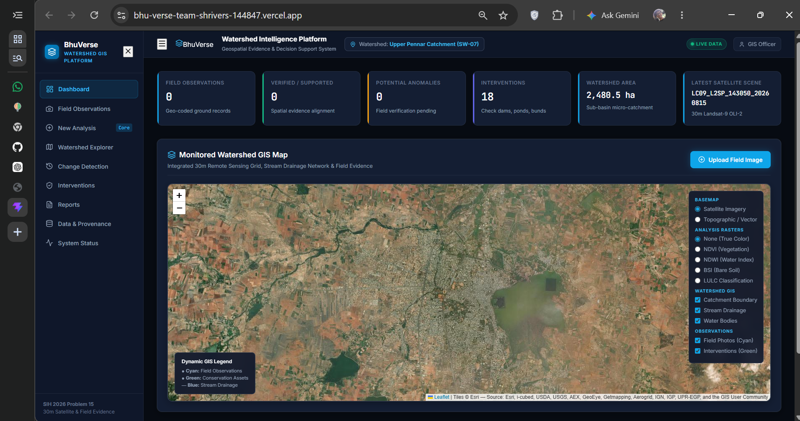
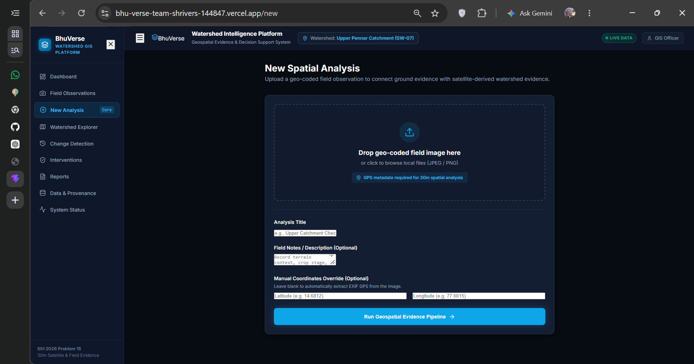
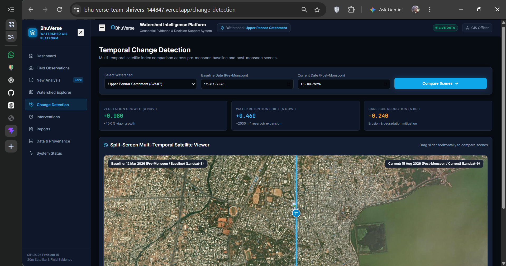

# BhuVerse

## Watershed Assessment & Monitoring System

BhuVerse is a geospatial intelligence and decision-support platform developed by **Team Shrivers** for **Smart India Hackathon 2026 – Problem Statement SIH26015**.

The platform focuses on the visualization and analysis of geo-coded images by combining field observations, satellite data and GIS layers. It provides an integrated workflow for watershed assessment, spatial analysis, temporal change detection and watershed potential estimation.

---

## Smart India Hackathon 2026

**Problem Statement ID:** SIH26015

**Problem Statement:**

> Application of Geospatial Techniques for visualization and analysis to interpret Geo-Coded Images to enhance watershed Development Outcomes.

**Team:** Shrivers

**Team ID:** 144847

---

# 1. Overview

Watershed development requires information about land use, drainage patterns, vegetation cover, water bodies and changes occurring over time.

This information can come from multiple sources such as:

- Geo-coded field images
- Satellite imagery
- GIS layers
- Field observations
- Spatial datasets

However, these sources are often handled separately. Manual watershed assessment and reporting can be time-consuming, while fragmented spatial data makes it difficult to connect field-level observations with satellite-derived information.

Existing maps and monitoring systems can help describe the current condition of a watershed, but there is also a need for more actionable, potential-oriented insights.

**BhuVerse** addresses this gap by integrating geo-coded field evidence, satellite data and GIS-based analysis into a single watershed intelligence platform.

---

## Interface Preview

BhuVerse provides an interactive GIS dashboard for watershed monitoring, field evidence analysis, and temporal change detection.

<p align="center">
  
  
  
</p>


---
# 2. Problem

The major challenges addressed by BhuVerse are:

### Manual Watershed Assessment

Traditional field surveys and reporting can be time-consuming and require significant manual effort.

### Fragmented Spatial Data

Images, satellite data and field observations may remain disconnected, making integrated analysis difficult.

### Limited Change Monitoring

Tracking changes in land, water and vegetation across different time periods can be difficult without an integrated temporal analysis workflow.

### Lack of Potential-Based Insights

Conventional maps primarily show existing conditions. They do not necessarily provide insights into what a watershed can potentially deliver through suitable interventions.

---

# 3. Existing Approaches

Several existing resources and approaches are available for watershed monitoring and development:

### Bhuvan IWMP-SRISHTI

Provides satellite and field-based resources for watershed monitoring.

### WDC-PMKSY Dashboard

Supports monitoring of watershed works and development progress.

### Satellite-Based Monitoring

Provides large-area spatial monitoring using satellite data.

### Field Data Collection

Captures ground-level observations and geo-tagged photographs.

### Gap

The availability of these different data sources does not automatically provide an integrated workflow for connecting field evidence, satellite information, spatial analysis and actionable watershed potential.

BhuVerse is designed around this integration.

---

# 4. Proposed Solution

BhuVerse provides an integrated GIS framework combining:

```text
Geo-Coded Images
        +
Satellite Data
        +
GIS Layers
        ↓
Unified GeoSpatial Analysis
        ↓
Automated Spatial Insights
        ↓
Temporal Change Detection
        ↓
Watershed Potential Estimation
        ↓
Interactive GIS Dashboard
```
# 5. Key Features

## 5.1 Geo-Coded Image Analysis

Upload geo-coded field images and use their GPS information as ground-level spatial evidence. Manual latitude and longitude can also be provided when required.

## 5.2 Integrated GIS Framework

Combines field observations, satellite imagery and GIS layers into a unified spatial analysis environment.

## 5.3 AI-Based Image Segmentation

Uses a U-Net based pipeline with PyTorch and OpenCV to extract relevant features from input images.

## 5.4 Land, Water & Vegetation Analysis

Supports spatial analysis of land conditions, water bodies and vegetation using satellite-derived indices and GIS layers.

## 5.5 Drainage Analysis

Visualizes stream drainage networks along with watershed boundaries, water bodies and field observations.

## 5.6 GIS Layer Integration

Provides interactive layers for:

- Catchment Boundaries
- Stream Drainage
- Water Bodies
- Field Observations
- Interventions
- Satellite Imagery
- NDVI
- NDWI
- BSI
- Land Use / Land Cover

## 5.7 Temporal Change Detection

Compares satellite scenes from different dates to identify changes in:

- Vegetation
- Water retention
- Bare soil

The system provides corresponding change indicators for comparative analysis.

## 5.8 Watershed Potential Estimator

Moves beyond showing existing conditions by estimating watershed potential using parameters such as:

- Water Potential
- Benefited Area
- Cost
- Impact

The objective is to provide planning-oriented insights into what a watershed can potentially deliver.

## 5.9 Interactive GIS Dashboard

Provides a centralized dashboard for watershed monitoring, spatial visualization and analysis.

Main modules include:

- Dashboard
- Field Observations
- New Spatial Analysis
- Watershed Explorer
- Change Detection
- Interventions
- Reports
- Data & Provenance
- System Status

## 5.10 Field Observation Management

Stores and visualizes geo-coded field observations within the watershed map, allowing ground-level evidence to be viewed alongside spatial datasets.

## 5.11 New Spatial Analysis

Provides a workflow for:

1. Uploading a geo-coded field image
2. Extracting or entering GPS coordinates
3. Adding analysis title and field notes
4. Running the geospatial evidence pipeline

## 5.12 Watershed Explorer

Provides an interactive view of watershed boundaries, drainage, water bodies, observations and other spatial layers.

## 5.13 Intervention Mapping

Displays watershed interventions alongside other GIS layers to support spatial monitoring and planning.

## 5.14 Spatial Evidence Reports

Generates structured watershed reports combining field observations and spatial evidence, with an option to print or save the report as PDF.

## 5.15 Data & Provenance

Provides information about the datasets and spatial evidence used within the platform, supporting traceability and transparency.

## 5.16 System Status

Provides a dedicated interface for monitoring the operational status of the platform and its components.


# 6. Technical Workflow

BhuVerse follows a simple end-to-end workflow:

**Geo-Coded Field Images + Satellite Data + GIS Layers**  
↓  
**Data Preprocessing**  
↓  
**AI-Based Image Analysis**  
↓  
**Integrated GIS Analysis**  
↓  
**Land, Water, Vegetation & Drainage Analysis**  
↓  
**Temporal Change Detection**  
↓  
**Watershed Potential Estimation**  
↓  
**Interactive GIS Dashboard**  
↓  
**Reports & Decision Support**


# 7. System Architecture

The system is divided into four major layers:

### 1. Input Layer
- Geo-coded field images
- Satellite imagery
- GIS datasets
- Watershed boundaries and spatial layers

### 2. Processing Layer
- Image preprocessing
- U-Net based image segmentation
- Spatial data processing
- GIS analysis
- Satellite-derived index calculation

### 3. Analysis Layer
- Land analysis
- Water analysis
- Vegetation analysis
- Drainage analysis
- Temporal change detection
- Watershed potential estimation

### 4. Application Layer
- Interactive GIS dashboard
- Watershed explorer
- Field observations
- Intervention mapping
- Reports
- Data & provenance


# 8. Technology Stack

| Category | Technologies |
|---|---|
| Frontend | React, JavaScript, React-Leaflet |
| Backend | Python, FastAPI, REST APIs |
| AI / ML | U-Net, PyTorch, OpenCV |
| GIS / Spatial Processing | GDAL, Rasterio, GeoPandas, Shapely |
| Database | PostgreSQL, PostGIS |


# 9. Data Components

BhuVerse works with multiple sources of spatial evidence:

- Geo-coded field images
- Satellite imagery
- Catchment boundaries
- Stream drainage
- Water bodies
- Field observations
- Intervention locations
- NDVI
- NDWI
- BSI
- Land Use / Land Cover data


# 10. Platform Workflow

1. **Select Watershed**  
   Select the watershed or catchment area.

2. **Upload Field Evidence**  
   Upload a geo-coded field image.

3. **Extract GPS**  
   GPS coordinates are extracted from image metadata or entered manually.

4. **Run Spatial Analysis**  
   Process the field observation through the geospatial pipeline.

5. **Integrate Spatial Data**  
   Connect field evidence with satellite and GIS data.

6. **Analyse Watershed Conditions**  
   Analyse land, water, vegetation and drainage information.

7. **Detect Temporal Changes**  
   Compare satellite observations from different time periods.

8. **Estimate Watershed Potential**  
   Evaluate potential using parameters such as water potential, benefited area, cost and impact.

9. **Visualize Results**  
   Explore the results through the interactive GIS dashboard.

10. **Generate Report**  
    Generate a structured spatial evidence report.


# 11. Feasibility

BhuVerse uses established AI, GIS and web technologies to create a practical workflow for watershed monitoring.

- Geo-coded images provide ground-level evidence.
- Satellite data enables large-area monitoring.
- U-Net supports automated image segmentation.
- FastAPI provides the backend API layer.
- GIS libraries enable spatial processing and visualization.
- Temporal analysis supports monitoring across different periods.
- The dashboard brings the complete workflow into one interface.


# 12. Challenges & Mitigation

### GPS Accuracy
Missing or incorrect GPS metadata can affect spatial analysis.

**Mitigation:** GPS validation and optional manual coordinate input.

### Satellite Resolution
30 m imagery may not capture very small ground features.

**Mitigation:** Combine satellite information with geo-coded field evidence.

### Landscape Variation
Different environmental conditions can affect model performance.

**Mitigation:** Model validation and fine-tuning using suitable reference data.

### Limited Data
Insufficient field or spatial data can affect derived insights.

**Mitigation:** Clearly distinguish observed information from estimated results.


# 13. Impact & Benefits

### Environmental
- Improved watershed monitoring
- Better land and water assessment
- Vegetation change tracking
- Support for conservation planning

### Economic
- Better intervention planning
- Improved resource allocation
- Reduced dependence on repetitive manual assessment

### Social
- Better watershed planning
- Improved field-level decision support
- Easier access to spatial information


# 14. Uniqueness

BhuVerse connects multiple sources of watershed evidence in one platform:

**Geo-Coded Field Evidence + Satellite Data + GIS Layers + AI Analysis + Temporal Change Detection + Watershed Potential Estimation**

The key differentiator is the **Watershed Potential Estimator**, which moves the platform beyond simply displaying existing conditions toward potential-oriented decision support.


# 15. Current Prototype

The working BhuVerse prototype includes:

- Interactive watershed dashboard
- Satellite map visualization
- Geo-coded image upload
- Field observation mapping
- GIS layer visualization
- AI-based image analysis
- Temporal change detection
- Intervention mapping
- Watershed potential estimation
- Spatial evidence reports


# 16. Links

### Live Prototype
https://bhu-verse-team-shrivers-144847.vercel.app/

### GitHub Repository
https://github.com/adityasoni-003/BhuVerse_TeamShrivers_144847

### Demonstration Video
https://youtu.be/j2W4csML1Xw


### Detailed Project Report
https://drive.google.com/file/d/1sZkWTcBUsrP_sh1XM4pcDxnxYia7xHd-/view?usp=drive_link


# 17. Team Shrivers

| Member | Responsibilities |
|---|---|
| **Shubham Kumar** | Documentation, Research, Backend Logic |
| **Aditya Soni** | Frontend UI/UX Design, Model Handling, GitHub |
| **Prem Kumar Rai** | Model Fine-tuning, Backend Refinement |
| **Apurva Gautam** | GitHub, Model Fine-tuning |
| **Nilabh Kishlay** | GitHub, Presentation, Documentation |
| **Annem Lasya Sree** | Report, Research, Presentation |


# 18. Future Scope

- Larger and more diverse training datasets
- Improved segmentation models
- Additional satellite data sources
- Advanced watershed potential estimation
- More detailed intervention analysis
- Improved spatial prediction
- Automated report generation
- Larger-scale watershed processing
- Additional GIS dataset integration


# 19. References

### Bhuvan – ISRO / NRSC
https://bhuvan.nrsc.gov.in/

### WDC-PMKSY
https://wdcpmksy.dolr.gov.in/

### National Remote Sensing Centre – ISRO
https://www.nrsc.gov.in/

### U-Net
Ronneberger, O., Fischer, P., & Brox, T. (2015).  
*U-Net: Convolutional Networks for Biomedical Image Segmentation.*

https://arxiv.org/abs/1505.04597

### GDAL
https://gdal.org/

### GeoPandas
https://geopandas.org/

### Shapely
https://shapely.readthedocs.io/


# 20. Conclusion

BhuVerse brings geo-coded field observations, satellite data, AI-based image analysis and GIS into a single watershed intelligence platform.

It provides an integrated workflow for:

- Geo-coded image analysis
- GIS-based spatial analysis
- Land, water and vegetation monitoring
- Temporal change detection
- Watershed potential estimation
- Interactive visualization
- Spatial evidence reporting

The platform is designed to move from simply **visualizing watershed conditions** toward **supporting data-driven watershed planning and decision making**.


# Copyright

Copyright © 2026 **Team Shrivers**. All Rights Reserved.

BhuVerse has been developed for **Smart India Hackathon 2026 – Problem Statement SIH26015**.

The source code, documentation, models, designs and associated project materials are the intellectual work of Team Shrivers. Unauthorized reproduction, redistribution or commercial use of the project or its components is prohibited without prior permission.

---

**BhuVerse — From Spatial Evidence to Watershed Intelligence.**
